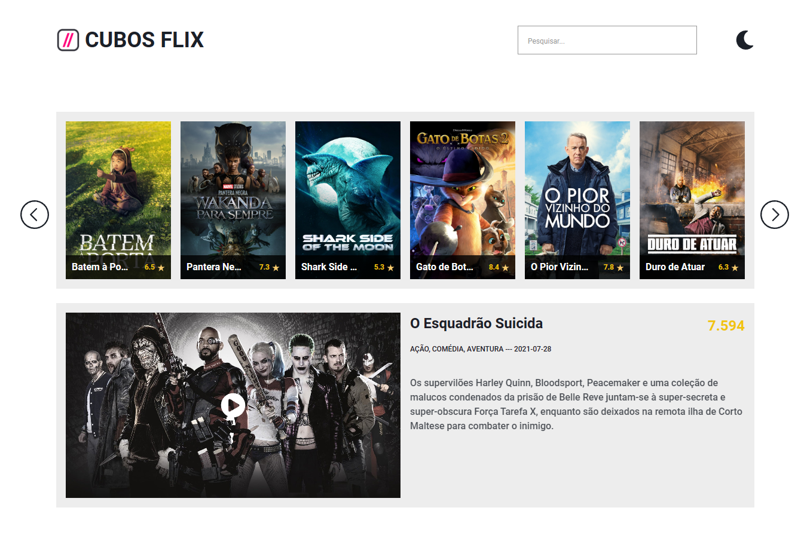

  

  
  <h1 align="center">
    Oi Tudo bem? Eu sou o 
    <a href="https://github.com/danilolliveira">Danilo Oliveira 😃️</a>
  </h1>
  
  

    Sou Desenvolvedor de Software Full Stack em Formação 🌱
  

  
  

    Tenho interesse em contribuir como Desenvolvedor Web Back-end, Front-end ou Full Stack 🤝
  

  

  

 
  

  
  ## Tecnologias que eu uso no meu dia:

 
   
 
  
 
 
 
 ## Tecnologias que estou aprendendo:
 
  
  

  
 
    
   ## Último projeto no qual eu Trabalhei:
   

    Nesse projeto fui desafiado a tornar uma página web funcional, até então feita apenas com HTML e CSS. Minha primeira tarefa como desenvolvedor responsável foi criar uma aplicação para uma simulaçao de um serviço de streaming. Usando JavaScript, e acessadno elementos do HTML pela DOM, foi possivel fazer a Requisição da Api e dos Endpoints necessários. Esse desafio contava com alguns requisitos obrigatórios, sendo eles: Visualização de filmes, Paginação de filmes (Tornar os botões de de Next e Prev funcionais), Busca de filmes (Tornar o input de buscar funcional), Filme do dia (Dados requisitados do endpoint respónsavel) e Modal de filme (Modal exibido ao clicar na capa do filme).
  
 
        
 
 
  
  

